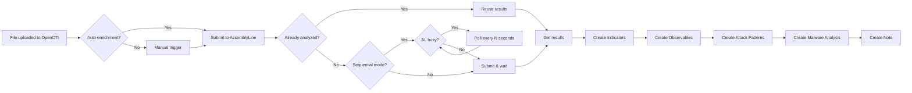

# OpenCTI AssemblyLine Connector


An **internal enrichment connector** for [OpenCTI](https://github.com/OpenCTI-Platform/opencti) that integrates with [AssemblyLine](https://cybercentrecanada.github.io/assemblyline4_docs/) malware analysis platform.

This connector automatically submits files (Artifacts and StixFiles) to AssemblyLine for analysis and enriches OpenCTI with the results, including malicious IOCs, MITRE ATT&CK techniques, and malware family attributions.

## 📋 Table of Contents

- [Features](#-features)
- [Requirements](#-requirements)
- [Installation](#-installation)
- [Docker (Recommended)](#docker-recommended)
- [Manual Installation](#manual-installation)
- [Configuration](#-configuration)
- [Usage](#-usage)
- [Created Objects](#-created-objects)
- [Screenshots](#-screenshots)
- [Troubleshooting](#-troubleshooting)
- [Contributing](#-contributing)
- [License](#-license)

## ✨ Features

### Core Features

- **Automatic File Submission**: Submits Artifacts and StixFiles to AssemblyLine for analysis
- **Intelligent Caching**: Reuses existing AssemblyLine analysis results to avoid redundant submissions
- **Retry Mechanism**: Automatic retry for files still being uploaded to OpenCTI

### Enrichment Capabilities

- **Malicious IOC Extraction**: Extracts domains, IPs, URLs marked as malicious
- **Indicator Creation**: Creates STIX Indicators with proper patterns
- **Observable Creation**: Creates corresponding Observables linked to Indicators via "based-on" relationships
- **Malware Family Detection**: Identifies and creates Malware objects for detected families
- **MITRE ATT&CK Mapping**: Extracts and creates Attack Pattern objects from AssemblyLine's attack matrix

### Advanced Features

- **Sequential Mode**: Waits for AssemblyLine to be idle before submitting a new file, preventing platform overload (enabled by default)
- **Malware Analysis SDO**: Creates STIX 2.1 Malware Analysis objects (visible in OpenCTI's "Malware Analysis" section)
- **Author Attribution**: All created objects are attributed to "AssemblyLine" identity
- **Suspicious IOC Support**: Optional inclusion of suspicious (not just malicious) IOCs
- **Configurable File Size Limit**: Prevents submission of files exceeding a specified size

## 📦 Requirements

- **OpenCTI Platform**: Version 6.x or higher
- **AssemblyLine**: Version 4.x with API access
- **Python**: 3.10 or higher
- **Docker**: (recommended for deployment)

## 🚀 Installation

### Docker (Recommended)

1. **Clone the repository**:

```bash
git clone https://github.com/yourusername/opencti-assemblyline-connector.git
cd opencti-assemblyline-connector
```

2. **Configure environment variables** (see [Configuration](#-configuration))

3. **Build and run with Docker Compose**:

```bash
docker-compose up -d
```

### Manual Installation

1. **Clone the repository**:

```bash
git clone https://github.com/yourusername/opencti-assemblyline-connector.git
cd opencti-assemblyline-connector
```

2. **Create virtual environment**:

```bash
python3 -m venv venv
source venv/bin/activate
```

3. **Install dependencies**:

```bash
pip install -r requirements.txt
```

4. **Configure the connector** (copy and edit config file):

```bash
cp src/config.yml.sample src/config.yml
# Edit src/config.yml with your settings
```

5. **Run the connector**:

```bash
cd src
python main.py
```

## ⚙️ Configuration

### Environment Variables

| Variable | Required | Default | Description |
|----------|----------|---------|-------------|
| `OPENCTI_URL` | ✅ | - | OpenCTI platform URL |
| `OPENCTI_TOKEN` | ✅ | - | OpenCTI API token |
| `CONNECTOR_ID` | ✅ | - | Unique connector identifier (UUIDv4) |
| `CONNECTOR_NAME` | ❌ | `AssemblyLine` | Connector name displayed in OpenCTI |
| `CONNECTOR_SCOPE` | ❌ | `Artifact,StixFile` | Observable types to process |
| `CONNECTOR_AUTO` | ❌ | `true` | Enable automatic enrichment |
| `CONNECTOR_CONFIDENCE_LEVEL` | ❌ | `80` | Default confidence level (0-100) |
| `CONNECTOR_LOG_LEVEL` | ❌ | `info` | Log level (debug, info, warning, error) |
| `ASSEMBLYLINE_URL` | ✅ | - | AssemblyLine instance URL |
| `ASSEMBLYLINE_USER` | ✅ | - | AssemblyLine username |
| `ASSEMBLYLINE_APIKEY` | ✅ | - | AssemblyLine API key |
| `ASSEMBLYLINE_VERIFY_SSL` | ❌ | `true` | Verify SSL certificates |
| `ASSEMBLYLINE_SUBMISSION_PROFILE` | ❌ | `static_with_dynamic` | AssemblyLine submission profile |
| `ASSEMBLYLINE_CLASSIFICATION` | ❌ | `TLP:C` | Classification for submitted files |
| `ASSEMBLYLINE_TIMEOUT` | ❌ | `600` | Analysis timeout in seconds |
| `ASSEMBLYLINE_FORCE_RESUBMIT` | ❌ | `false` | Force resubmission even if already analyzed |
| `ASSEMBLYLINE_MAX_FILE_SIZE_MB` | ❌ | `1` | Maximum file size to submit (MB) |
| `ASSEMBLYLINE_INCLUDE_SUSPICIOUS` | ❌ | `false` | Include suspicious IOCs (not just malicious) |
| `ASSEMBLYLINE_CREATE_ATTACK_PATTERNS` | ❌ | `true` | Create MITRE ATT&CK patterns |
| `ASSEMBLYLINE_CREATE_MALWARE_ANALYSIS` | ❌ | `true` | Create Malware Analysis SDO |
| `ASSEMBLYLINE_CREATE_OBSERVABLES` | ❌ | `true` | Create Observables from Indicators |
| `ASSEMBLYLINE_SEQUENTIAL_MODE` | ❌ | `true` | Wait for AL to be idle before submitting (prevents overload) |
| `ASSEMBLYLINE_POLL_INTERVAL` | ❌ | `30` | Seconds between checks when AL is busy |

### Configuration File (config.yml)

```yaml
opencti:
  url: 'http://localhost:8080'
  token: 'ChangeMe'

connector:
  id: 'ChangeMe'
  type: 'INTERNAL_ENRICHMENT'
  name: 'AssemblyLine'
  scope: 'Artifact,StixFile'
  auto: true
  confidence_level: 80
  log_level: 'info'

assemblyline:
  url: 'https://assemblyline.example.com'
  user: 'admin'
  apikey: 'ChangeMe'
  verify_ssl: true
  submission_profile: 'static_with_dynamic'
  timeout: 600
  force_resubmit: false
  max_file_size_mb: 1
  include_suspicious: false
  create_attack_patterns: true
  create_malware_analysis: true
  create_observables: true
  sequential_mode: true
  poll_interval: 30
```

## 📖 Usage

### Automatic Enrichment

When `CONNECTOR_AUTO=true`, the connector automatically processes any new Artifact or StixFile created in OpenCTI.

### Manual Enrichment

1. Navigate to an **Artifact** or **StixFile** in OpenCTI
2. Click the **"Enrichment"** button
3. Select **"AssemblyLine"** from the list
4. Wait for the analysis to complete

### Workflow



### Sequential Mode

When `ASSEMBLYLINE_SEQUENTIAL_MODE=true` (default), the connector checks if AssemblyLine has any active analyses (`state:submitted`) before submitting a new file. If analyses are in progress, it waits and re-checks every `ASSEMBLYLINE_POLL_INTERVAL` seconds until AssemblyLine is idle.

This prevents the platform from being overloaded when multiple files are submitted simultaneously. Since `_process_message` is blocking, RabbitMQ naturally queues the pending messages until the connector is ready for the next file.

Sequential mode activity is logged with the `[Sequential]` prefix for easy filtering.

## 📊 Created Objects

The connector creates the following objects in OpenCTI:

### Indicators

For each malicious IOC (domain, IP, URL), an Indicator is created with:
- STIX pattern (e.g., `[domain-name:value = 'malware.com']`)
- Score: 80/100
- Labels: `malicious`, `assemblyline`
- Author: AssemblyLine

### Observables

When `ASSEMBLYLINE_CREATE_OBSERVABLES=true`, corresponding Observables are created:
- Domain-Name
- IPv4-Addr / IPv6-Addr
- URL

Each Observable is linked to its Indicator via a **"based-on"** relationship.

### Malware Objects

For detected malware families:
- Name: Family name (e.g., "EMOTET", "TRICKBOT")
- Type: Family
- Relationship: "related-to" with the analyzed file

### Attack Patterns

MITRE ATT&CK techniques extracted from AssemblyLine:
- Name: `T1059.001 - PowerShell`
- External reference to MITRE ATT&CK
- Kill chain phases
- Relationship: "uses" with the analyzed file

### Malware Analysis SDO

A STIX 2.1 Malware Analysis object containing:
- Product: AssemblyLine
- Result: malicious/suspicious/benign/unknown
- Analysis timestamps
- Link to AssemblyLine submission
- References to extracted IOCs

### Note

A summary note attached to the analyzed file with:
- Verdict (MALICIOUS/SAFE)
- Score
- IOC counts
- File information
- Link to AssemblyLine

## 📸 Screenshots

### Enrichment Results


### Malware Analysis Section


### Relationships Graph


## 🔧 Troubleshooting

### Common Issues

#### "Artifact has no file content for analysis"

**Cause**: The file is still being uploaded to OpenCTI or only contains hashes.

**Solution**: 
- Wait for the upload to complete
- If using hash-only artifacts, ensure AssemblyLine has previously analyzed this file

#### "File size exceeds maximum limit"

**Cause**: The file is larger than `ASSEMBLYLINE_MAX_FILE_SIZE_MB`.

**Solution**: Increase the limit in configuration or exclude large files from enrichment.

#### "Timeout waiting for AssemblyLine results"

**Cause**: Analysis is taking longer than `ASSEMBLYLINE_TIMEOUT`.

**Solution**: 
- Increase the timeout value
- Check AssemblyLine queue status
- Verify AssemblyLine services are running

#### SSL Certificate Errors

**Cause**: Self-signed or invalid SSL certificate on AssemblyLine.

**Solution**: Set `ASSEMBLYLINE_VERIFY_SSL=false` (not recommended for production).

#### Files waiting too long before submission

**Cause**: In sequential mode, the connector waits for AssemblyLine to finish all active analyses before submitting a new file.

**Solution**:
- Check the logs for `[Sequential] AssemblyLine has N active analysis(es)` to see how many analyses are running
- Reduce `ASSEMBLYLINE_POLL_INTERVAL` for faster detection when AL becomes idle
- If your AssemblyLine instance can handle parallel analyses, set `ASSEMBLYLINE_SEQUENTIAL_MODE=false`

### Debug Mode

Enable debug logging for more detailed output:

```yaml
connector:
  log_level: 'debug'
```

### Logs

View connector logs:

```bash
# Docker
docker logs -f opencti-assemblyline-connector

# Manual
tail -f /var/log/opencti/assemblyline-connector.log
```

## 🤝 Contributing

Contributions are welcome! Please follow these steps:

1. Fork the repository
2. Create a feature branch (`git checkout -b feature/amazing-feature`)
3. Commit your changes (`git commit -m 'Add amazing feature'`)
4. Push to the branch (`git push origin feature/amazing-feature`)
5. Open a Pull Request

### Development Setup

```bash
# Clone your fork
git clone https://github.com/yourusername/opencti-assemblyline-connector.git
cd opencti-assemblyline-connector

# Create virtual environment
python3 -m venv venv
source venv/bin/activate

# Install dev dependencies
pip install -r requirements-dev.txt

# Run tests
pytest tests/
```

## 📄 License

This project is licensed under the Apache License 2.0 - see the [LICENSE](LICENSE) file for details.

## 🙏 Acknowledgments

- [OpenCTI Platform](https://github.com/OpenCTI-Platform/opencti) - Open Cyber Threat Intelligence Platform
- [AssemblyLine](https://cybercentrecanada.github.io/assemblyline4_docs/) - Canadian Centre for Cyber Security
- [STIX 2.1](https://oasis-open.github.io/cti-documentation/stix/intro.html) - Structured Threat Information Expression

## 📧 Support

- **Issues**: [GitHub Issues](https://github.com/yourusername/opencti-assemblyline-connector/issues)
- **Discussions**: [GitHub Discussions](https://github.com/yourusername/opencti-assemblyline-connector/discussions)
- **Discord**: [S1EM Community](https://discord.gg/your-discord)

---

Made with ❤️ by [V1D1AN](https://github.com/V1D1AN)
